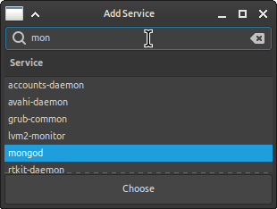

# Systemd Control Panel
This is a simple control panel to manage systemd service.

## Preview
This preview might not be up to date and might look different on your device depending on your gtk theme.




## Building
To build this project you need c++ compiler that support c++14 (new g++ or clang compiler should be fine), `cmake`, `make` (or `ninja`), and library `gtkmm-3.0`. You can install them using
```
sudo apt install libgtkmm-3.0-dev cmake make
```

### Build using `make`
```
cd <path-to-project>
cmake -B build && make -C build
```
Then the resulting binary should be located at `./build/systemd-control-panel`

### Build using `ninja`
Or if you prefer to use `ninja` instead of `make`
```
cd <path-to-project>
cmake -B build -GNinja && ninja -C build
```
